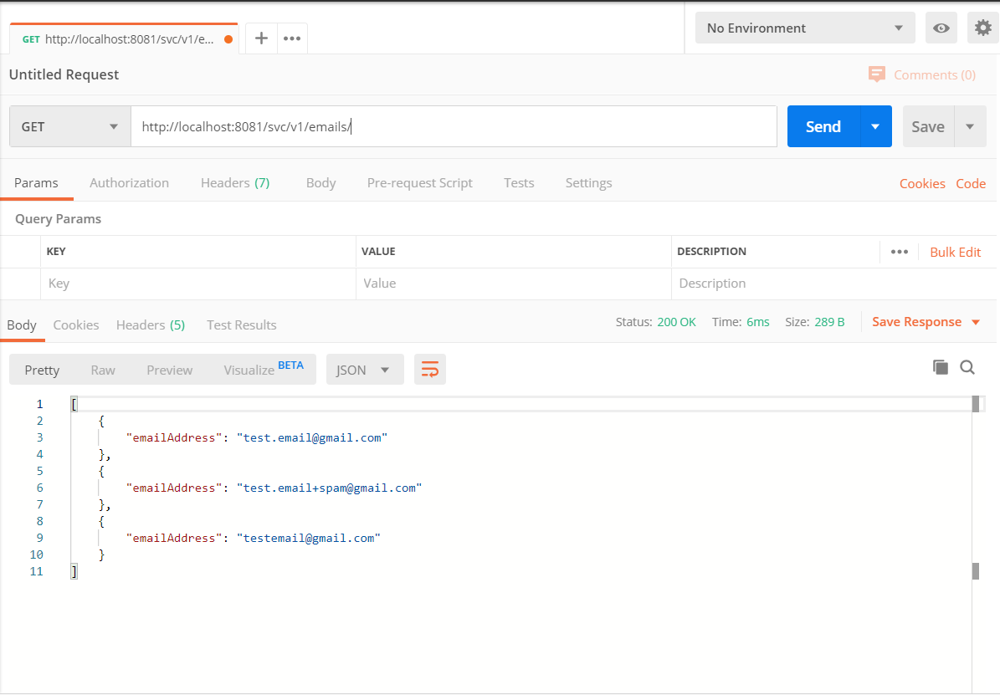
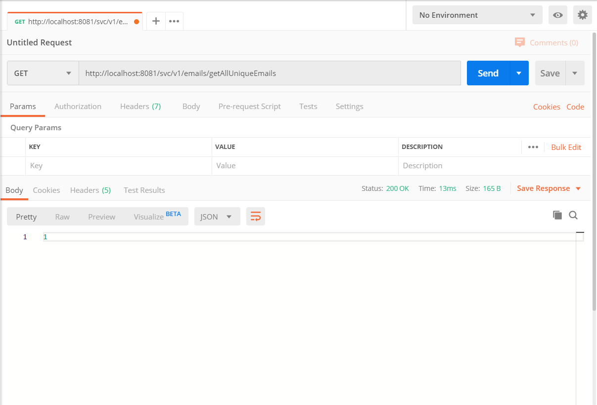

# FetchRewards-UniqueEmailAddress
A web service that takes in a list of email addresses and returns an integer indicating the number of unique email addresses where "unique" email addresses means they will be delivered to the same account using Gmail account matching specifically Gmail will ignore the placement of "." in the username and it will ignore any portion of the username after a "+".

## Description
The above mentioned REST API is developed using SpringBoot with the Java version being 1.8.

## Usage
Examples:
test.email@gmail.com, test.email+spam@gmail.com and testemail@gmail.com will all go to the same address, and thus the result should be 1.

The URL to hit the server is shown in the screenshots.
The first step is to consume the REST API containing list of emails.
To check if the REST API is giving the correct response i.e., giving the list of emails( which is hard codeed in EmailController.java class), see the screenshot below.

Now, to view the output i.e., an integer indicating the number of unique email addresses, see the screenshot below.
.

